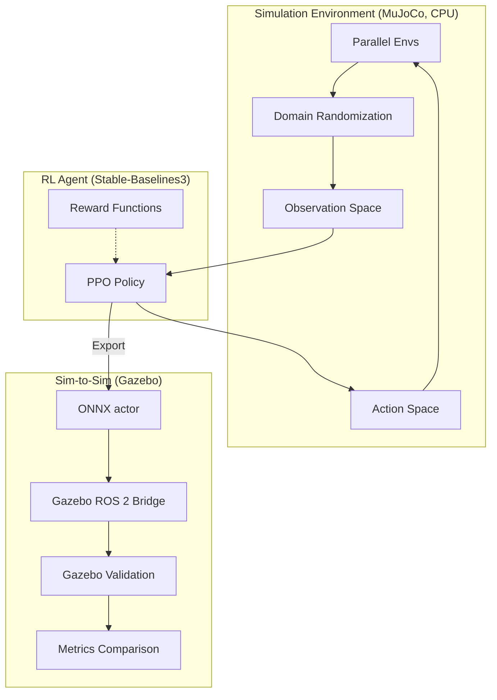

```mermaid
graph TD
    subgraph "Simulation Environment (MuJoCo, CPU)"
        A[Parallel Envs] --> B[Domain Randomization]
        B --> C[Observation Space]
        F[Action Space] --> A
    end
    
    subgraph "RL Agent (Stable-Baselines3)"
        C --> D[PPO Policy]
        D --> F
        E[Reward Functions] -.-> D
    end
    
    subgraph "Sim-to-Sim (Gazebo)"
        D -->|Export| G[ONNX actor]
        G --> H[Gazebo ROS 2 Bridge]
        H --> I[Gazebo Validation]
        I --> J[Metrics Comparison]
    end
```
